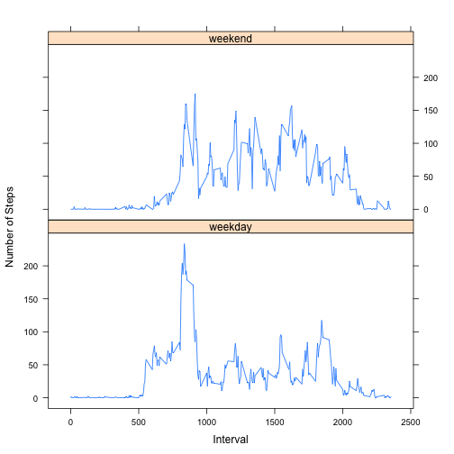

##Loading and preprocessing the data

####*Show any code that is needed to:*

####1. Load the data (i.e. read.csv())


```r
library("lattice")
setwd("~/Coursera/Reproducible_Research/Project1")

url_path <- "https://d396qusza40orc.cloudfront.net/repdata%2Fdata%2Factivity.zip"
Assigned_name_for_downloaded_file <- "pc_data.zip"

# This function will only download the file if it is not present in the working directory.
Download_file <- function(Name_existing_file, url){
        if(file.exists(Name_existing_file)){
                
        } else {
                download.file(url = url_path, 
                        destfile = Name_existing_file, method = "curl")
        }
}

Download_file(Assigned_name_for_downloaded_file, url_path)

file_info <- unzip(Assigned_name_for_downloaded_file, list=TRUE)
unzip(Assigned_name_for_downloaded_file)

Unzipped_filename <- as.character(file_info[1])
data <- read.csv(file=Unzipped_filename)
```
            
                         
##What is mean total number of steps taken per day?

####*For this part of the assignment, you can ignore the missing values in the dataset.*

####1. Make a histogram of the total number of steps taken each day


```r
DATA_for_PLOT1 <- aggregate(steps ~ date , data = data, sum)

hist(DATA_for_PLOT1$steps, breaks = 10, ylab = "number of days", xlab = "number of steps", 
     main = paste("Histogram of" , "steps per day"))
```

 

####2. Calculate and report the mean and median total number of steps taken per day


```r
options(scipen = 6) # bias against scientific notation
options(digits = 2) # show fewer decimal places
mean_value <- mean(DATA_for_PLOT1$steps)
median_value <- median(DATA_for_PLOT1$steps)
```
**The mean total number of steps each day is 10766.19.  
The median total number of steps each day is 10765.**


##**What is the average daily activity pattern?**

####1. Make a time series plot (i.e. type = "l") of the 5-minute interval (x-axis) and the average number of steps taken, averaged across all days (y-axis)


```r
DATA_for_avgPLOT <- aggregate(steps ~ interval, data = data, mean)

plot(DATA_for_avgPLOT, type = "l", main = "Number of steps taken vs interval - averaged across all days")
```

 

####2. Which 5-minute interval, on average across all the days in the dataset, contains the maximum number of steps?


```r
Five_min_interval_most <- 
        DATA_for_avgPLOT$interval[which.max(DATA_for_avgPLOT$steps)]
```
**5 minute interval with the highest average of steps: 835 **  

# **Imputing missing values**

####*Note that there are a number of days/intervals where there are missing values (coded as NA). The presence of missing days may introduce bias into some calculations or summaries of the data.*

#### 1.Calculate and report the total number of missing values in the dataset (i.e. the total number of rows with NAs)

```r
Missing_Values <- 
        length(data$steps) - length(data$steps[complete.cases(data$steps)])
```
**Total # of mising values (NA's): 2304 **  


#### 2. Devise a strategy for filling in all of the missing values in the dataset. The strategy does not need to be sophisticated. For example, you could use the mean/median for that day, or the mean for that 5-minute interval, etc.

#### **for missing (NA) values, a mean value is filled in which is taken as the mean of the other corresponding 5min intervals across all days.  

```r
data_capi <- aggregate(steps ~ interval, 
                       data = data[complete.cases(data$steps),], mean)
```

#### 3. Create a new dataset that is equal to the original dataset but with the missing data filled in.

```r
data_na_filled <- data

data_na_filled$steps <- ifelse(is.na(data_na_filled$steps), 
        data_capi$steps[data_capi$interval == data$interval] , data$steps)
```

#### 4.Make a histogram of the total number of steps taken each day and Calculate and report the mean and median total number of steps taken per day. Do these values differ from the estimates from the first part of the assignment? What is the impact of imputing missing data on the estimates of the total daily number of steps?

```r
DATA_for_PLOT2 <- aggregate(steps ~ date , data = data_na_filled, sum)

hist(DATA_for_PLOT2$steps, breaks = 10, ylab = "number of days",
     xlab = "number of steps", 
     main = paste("Histogram of" , "steps per day"))
```

 

```r
mean_value <- mean(DATA_for_PLOT2$steps)
median_value <- median(DATA_for_PLOT2$steps)
```
**The mean total number of steps each day is 10766.19.  
The median total number of steps each day is 10765.59.**

The mean value is the same because the method used to calculate the mean when the NA's were included simply ignored those values.  Had I chosen to impute the missing na values as the average across all intervals for the same day this mean value could have been different.  Perhaps the best way to impute the NA values would have been to fill in averages based on what day of the week it was (i.e, using the other days), but I chose to leave it this way since its not the point of this project and this "oh, this will be easy" project has already taken too much time to get done.

The median value is different because one of the imputed values (an average, which was not rounded to be an integer) ended up being the median value.  


##**Are there differences in activity patterns between weekdays and weekends?**

####*For this part the weekdays() function may be of some help here. Use the dataset with the filled-in missing values for this part.*

#### 1. Create a new factor variable in the dataset with two levels – “weekday” and “weekend” indicating whether a given date is a weekday or weekend day.  

```r
data_na_filled$day_type <- ifelse((weekdays(as.Date(data_na_filled$date)) == 
                "Saturday") | (weekdays(as.Date(data_na_filled$date)) == 
                                       "Sunday") , "weekend", "weekday")

data_na_filled$day_type <- as.factor(data_na_filled$day_type)
```

#### 2. Make a panel plot containing a time series plot (i.e. type = "l") of the 5-minute interval (x-axis) and the average number of steps taken, averaged across all weekday days or weekend days (y-axis). *See the README file in the GitHub repository to see an example of what this plot should look like using simulated data.*


```r
DATA_for_PLOT <- aggregate(steps ~ interval * day_type,
                           data = data_na_filled, mean)
at  <- seq(0,2500,500)
labels <- as.character(at)
xyplot(steps ~ interval | day_type, 
       data = DATA_for_PLOT, 
       type = "l" ,
       layout = c(1,2), 
       ylab = "Number of Steps", 
       xlab = "Interval",
       scales=list(y=list(tick.number = 5), x=list(
         at = at, labels = labels
         )))
```

 


